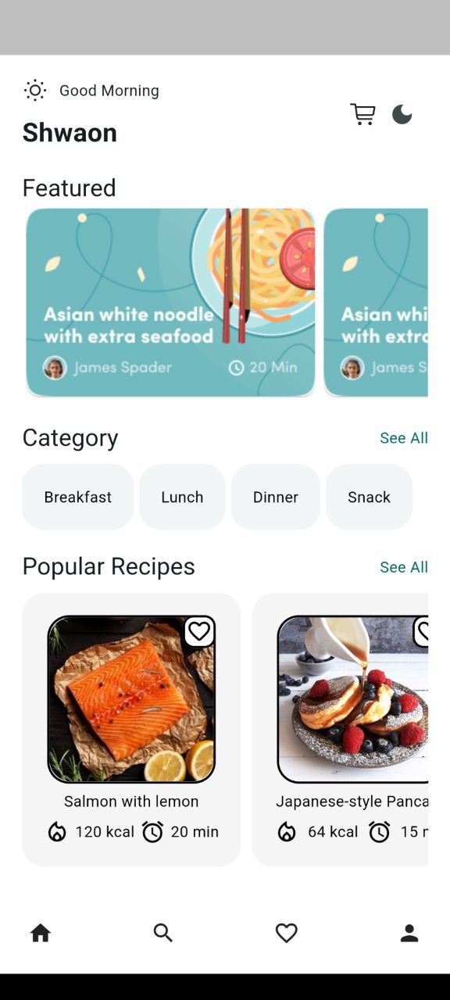
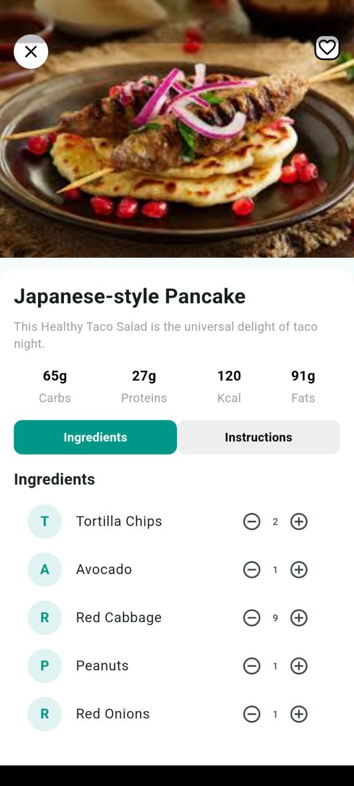
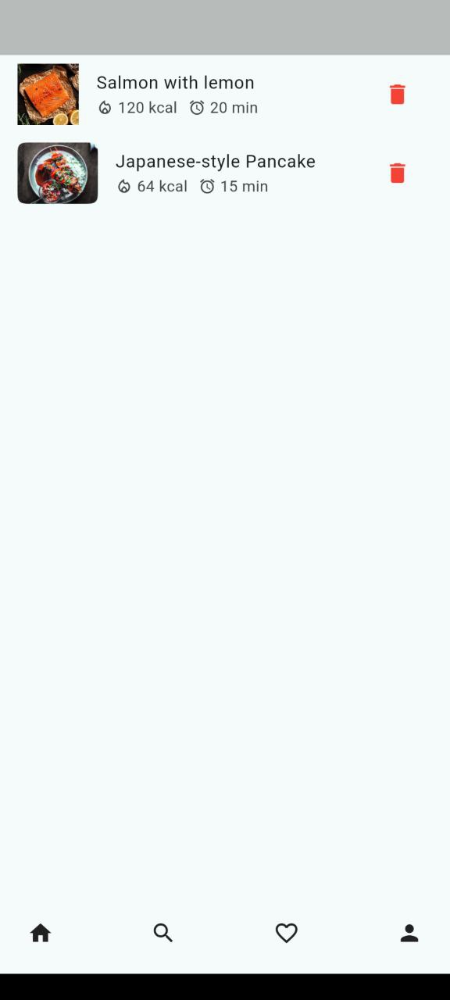
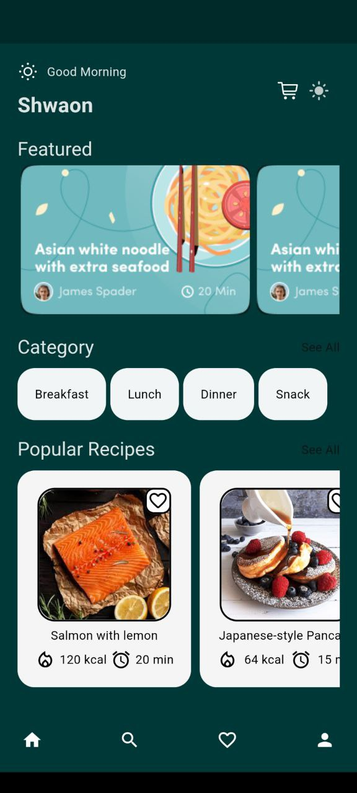
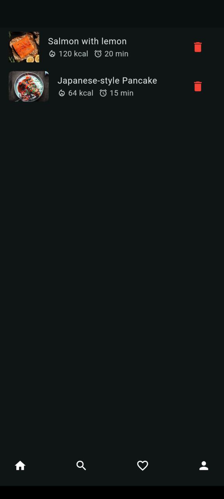

# 🍲 Recipe App

An elegant and user-friendly **Recipe App** built with Flutter. This app allows users to browse delicious recipes, view detailed information, and manage their favorite recipes seamlessly.

---

## 🛠 Technologies Used

- **Flutter**: Cross-platform mobile development framework for creating a smooth user experience.
- **Dart**: Programming language used for Flutter development.
- **Provider**: State management solution for managing favorites.
- **Custom Widgets**: Reusable components for better UI structure.
- **Figma**: UI/UX design inspiration for creating the app screens.

---

## 📸 Screenshots Light

| **Home Screen**              | **Recipe Details**                       | **Favorites Screen**                    |
|------------------------------|------------------------------------------|-----------------------------------------|
|  |  |  |

---
## 📸 Screenshots Dark

| **Home Screen**                    | **Recipe Details**                            | **Favorites Screen**                   |
|------------------------------------|-----------------------------------------------|----------------------------------------|
|  |  |  |

---
## 🎥 Screenrecord

https://github.com/user-attachments/assets/358f2723-65ef-4218-9f4a-ce0a608f7967

---
## 📱 Features

### 1. **Home Screen**
- Displays a list of recipes with:
   - **Image**
   - **Food Name**
   - **Calories**
   - **Preparation Time**
- Recipes are mapped dynamically using a `RecipeModel`.

### 2. **Recipe Details Screen**
- Detailed information about each recipe, including:
   - **Image**
   - Nutrition facts: Carbs, Proteins, Fats, and Calories
   - **Ingredients List** with counters for quantity adjustment.
- Functional **Favorite Icon** at the top-right corner to add/remove recipes from the favorites list.

### 3. **Favorites Screen**
- Displays all recipes marked as **Favorite**.
- Updates dynamically when a recipe is added/removed from favorites.

---

## 🔗 Figma Design Reference

- View the app design and prototype: [Figma File Link](https://www.figma.com/proto/ASUZ4xSOl5HSROZ5eSlJTj/%5BFREE%5D-Recipely---Food-Recipe-Mobile-App-UI-Kit-(Community)?node-id=1-8120&t=FTT6L6kGbuQpSHiB-1)

---

## 📂 Project Structure

```plaintext
lib/
│
├── main.dart                  # Entry point of the app
├── theme.dart                  # theme of the app
├── models/
│   └── recipe_model.dart      # Data model for recipes
│
├── providers/
│   └── favorites_provider.dart # State management for favorite recipes
│   └── color_provider.dart
│   └── theme_provider.dart
│
├── screens/
│   ├── home_screen.dart        # Displays list of recipes
│   ├── recipe_details_screen.dart # Detailed recipe screen
│   └── favorites_screen.dart   # Shows all favorite recipes
│   └── screens.dart
│
├── widgets/
│   └── recipe_widget.dart      # Custom widget to display a recipe
│   └── featured_card_widget.dart
│   └── category_widget.dart
│   └── bottom_nav_bar_widget.dart
│
└── assets/
    └── images/                 # All recipe images
```

---

## 🚀 How to Run the Project

1. **Clone the repository**:
   ```bash
   git clone https://github.com/https://github.com/mahabubulhasibshawon/recipe_provider.git/recipe-app.git
   cd recipe-app
   ```

2. **Install dependencies**:
   ```bash
   flutter pub get
   ```

3. **Run the app**:
   ```bash
   flutter run
   ```

---


## 🌟 Conclusion

This Recipe App showcases a clean and modular Flutter project with:
- Interactive UI components
- Dynamic state management using Provider
- Seamless navigation between Home, Recipe Details, and Favorites screens

Feel free to explore, contribute, and enhance the app further!

---

## 🙌 Author

**[Mahabub Ul Hasib Shawon]**  
Flutter Developer | [LinkedIn](https://www.linkedin.com/in/mahbub-ul-hasib-shawon/) | [GitHub](https://github.com/mahabubulhasibshawon)

